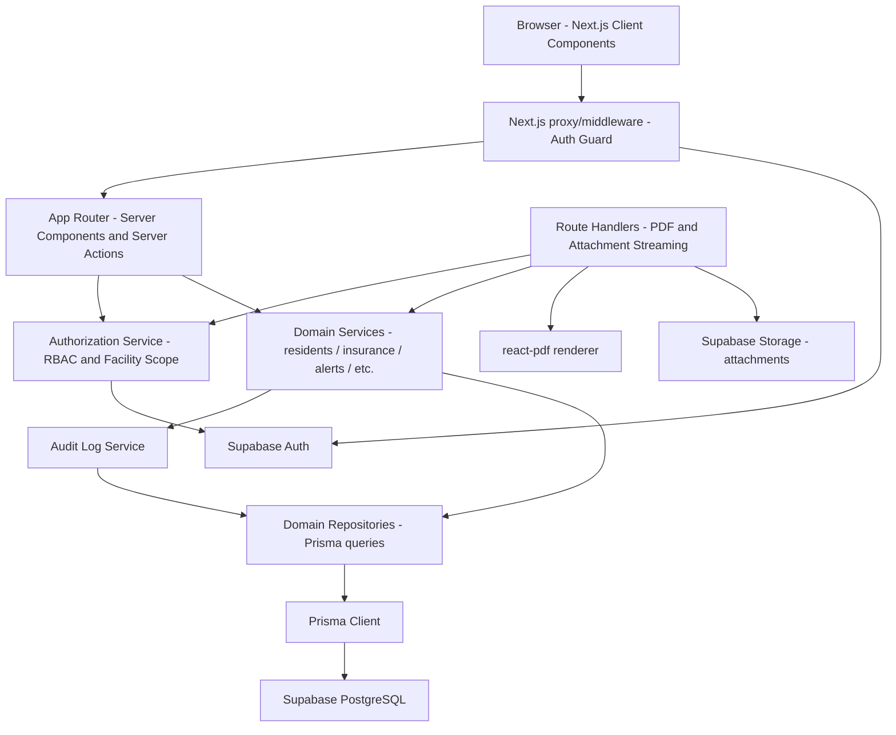
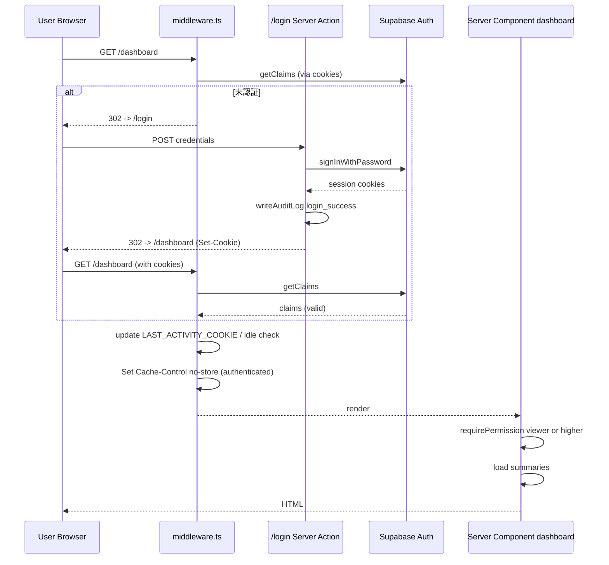
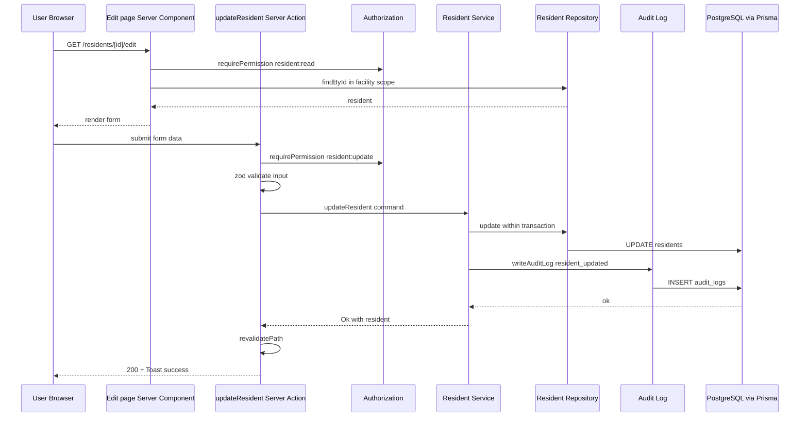
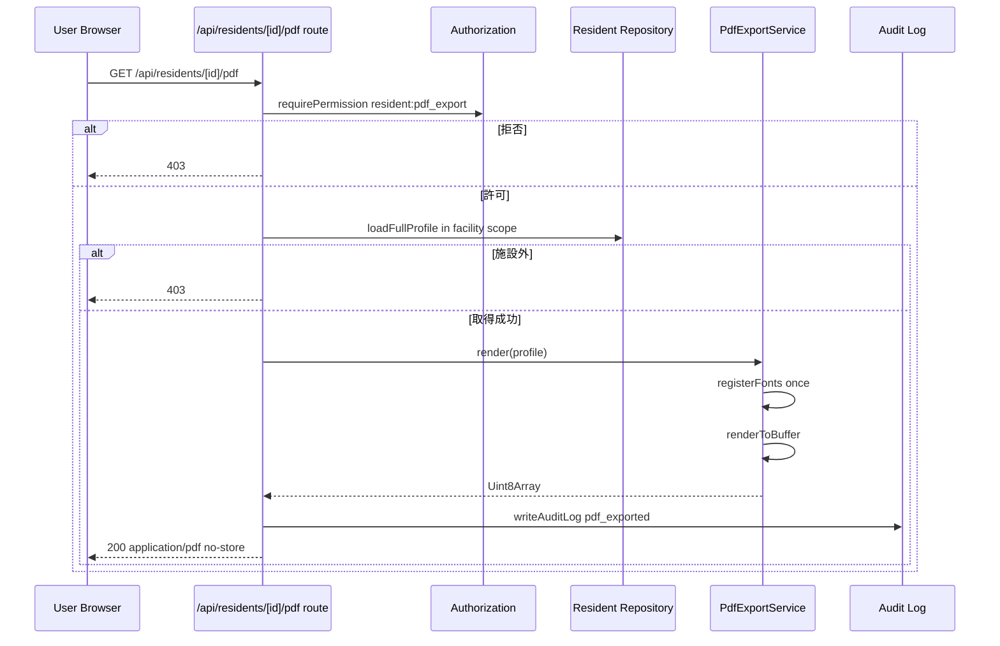
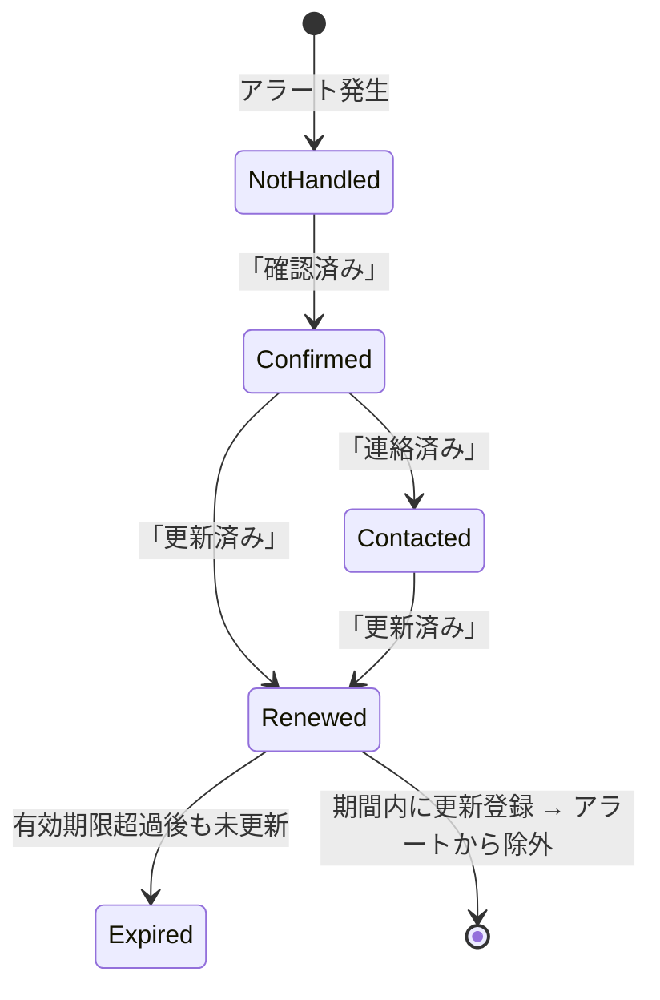
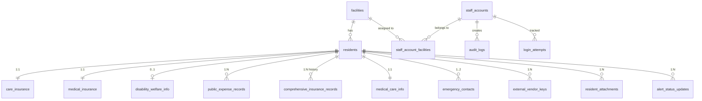
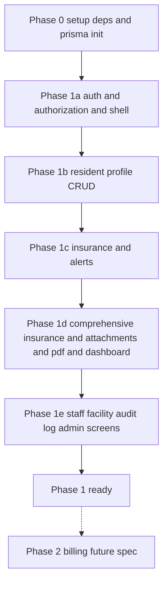

# Design Document

## Overview

**Purpose**: 老人ホーム利用者の基本情報・保険情報・関連連絡先を、紙／PDF からデジタル基盤に移行し、職員が安全に検索・編集・PDF 出力できる Web アプリケーションをフェーズ 1 として完成させる。

**Users**: 老人ホーム職員（管理者／一般職員／閲覧専用の 3 役割）。社内ブラウザから日常業務として利用する。

**Impact**: 現状の紙／PDF ベースの利用者情報管理を、認証・施設スコープ・監査ログを備えたデジタル基盤に置き換える。フェーズ 2（請求）／フェーズ 3（経営分析）が同じデータ基盤上に拡張できる土台を構築する。

### Goals

- Supabase Auth + アプリ層 RBAC + 施設スコープによる多層認可で個人情報を保護する
- Next.js 16 App Router の Server Components / Server Actions を基本とし、業務データを Prisma 経由でサーバ側のみが読み書きする構造を実現する
- ドメインモジュールを縦割り（`src/domains/<domain>`）、共通基盤を横串（`src/shared/`）に分離し、フェーズ 2／3 で拡張可能な構造を作る
- 期限切れ・更新予定の見落としを「期限アラート」「未請求一覧」「ダッシュボード」で運用上ゼロに近づける
- 個人情報を含む PDF・添付ファイルを認可済みリクエストのみに配信する

### Non-Goals

- フェーズ 2（売上・請求・入金消し込み・未入金一覧）の機能実装
- フェーズ 3（経営分析・前月対比・前年同月対比・CSV 出力）
- 介護記録（バイタル・サービス提供記録）
- 国際化（i18n）／RTL
- スマホ／タブレットネイティブアプリ
- マルチテナント分離（テナントごとに DB／インスタンスを分ける構成）

## Boundary Commitments

### This Spec Owns

- **業務データ**: 利用者プロファイル・保険情報（4 種）・利用者総合保険・医療／ケア／緊急連絡先・補足情報・外部業者連携キー・添付ファイル・期限アラート対応状況
- **アカウント／施設**: 職員アカウント・施設マスタ・職員と施設の所属関係
- **認証／認可**: ログイン・ログアウト・セッション・ロックアウト・3 役割 RBAC・施設スコープ
- **監査ログ**: 認証・利用者 CUD・PDF 出力・アカウント／施設変更・パスワードリセット
- **UI 基盤**: アプリシェル・ナビゲーション・DataTable・Form・UI プリミティブ・デザイントークン・ページレイアウト・境界
- **公開インタフェース**: Server Actions（フォーム入口）、Route Handlers（PDF・添付配信のみ）

### Out of Boundary

- 月次請求・入金消し込み（フェーズ 2 `billing-management`）
- 経営分析・CSV 出力（フェーズ 3 `business-analytics`）
- 介護記録・サービス提供記録
- 外部介護請求ソフト／医療機関との実 API 連携（連携キー保管まで）
- 個人情報のバックアップ運用・インシデント対応プロセス（運用ドキュメント側）

### Allowed Dependencies

- **Supabase**: Auth・PostgreSQL・Storage（ファイル添付）
- **Prisma**: 業務 DB アクセス
- **Next.js 16 / React 19 / Tailwind v4**: フレームワーク・UI
- **`@react-pdf/renderer`**: サーバ側 PDF 生成
- **`zod`**: 入力検証スキーマ
- 既存 steering: `tech.md` / `authentication.md` / `database.md` / `security.md`

### Revalidation Triggers

dependent specs（`billing-management` / `business-analytics`）や運用ドキュメントの再検証が必要となる変更:

- 利用者 / 施設 / 保険スキーマの破壊的変更
- 役割定義の追加・名称変更
- 認可ヘルパ `requirePermission` / `getAccessibleFacilityIds` の API シグネチャ変更
- Server Action の入出力型変更（フォームバウンダリ）
- 監査ログのイベント種別追加・スキーマ変更
- 環境変数の追加・必須化

## Architecture

### Architecture Pattern & Boundary Map



**Architecture Integration**:

- **Selected pattern**: Layered（Types → Repository → Service → Server Action / Route Handler → UI）× Vertical Slice（ドメイン縦割り）のハイブリッド。
- **Domain/feature boundaries**: 業務ドメインは `src/domains/<domain>/` に縦割り。横串の共通基盤（auth・authorization・db・supabase・ui）は `src/shared/`。
- **Existing patterns preserved**: 既存スケルトン（Next.js App Router + Tailwind v4 + `globals.css` のトークン構成）を維持・拡張。`@/*` → `src/*` の絶対パスエイリアス。
- **New components rationale**: 業務ドメインそのものが新規。共通レイヤは「認可・スコープ・UI 基盤・監査」を一元化するために必要。
- **Steering compliance**: `tech.md`（Server Components ファースト、Prisma + Supabase）／`authentication.md`（RBAC・施設スコープ）／`database.md`（命名・スコープ）／`security.md`（多層防御・PII 取扱）に準拠。

### Dependency Direction

```
shared/types ← shared/config ← shared/db, shared/supabase
                                       ↑
shared/auth ← shared/authorization ← shared/audit-log
                                       ↑
domains/<domain>/repository → domains/<domain>/service → domains/<domain>/actions
                                                                  ↑
                                                      app/(app)/<route>/page.tsx, layout.tsx
                                                      app/api/.../route.ts (Route Handlers)
                                                                  ↑
                                                      shared/ui (Server / Client Components)
```

- 各レイヤは **左から右へのみ** import 可能。逆方向は禁止。
- UI コンポーネント（`shared/ui`）は domain ロジックを呼ばず、props 経由でデータを受け取る。
- Server Actions と Route Handlers が「authorization → service → repository」の入口。
- Repository は Prisma に閉じ、Service に対して型付きの結果を返す。

### Technology Stack

| Layer | Choice / Version | Role in Feature | Notes |
|-------|------------------|-----------------|-------|
| Frontend | Next.js `16.2.6` App Router / React `19.2.4` / Tailwind `v4` | UI（Server Components 主体、必要箇所のみ Client） | 既存 |
| Auth | `@supabase/ssr` + `@supabase/supabase-js` | セッション・ログイン／ログアウト・パスワードリセット | `proxy.ts` で `getClaims()`、Server Action で `getUser()` |
| Authorization | アプリ層 RBAC（独自 `requirePermission` / `getAccessibleFacilityIds`） | 役割と施設スコープを単一実装で強制 | Supabase RLS は Storage の二次防御として利用 |
| Validation | `zod` | Form 入力・Server Action 入力・サーバ間境界の検証 | スキーマ単一定義（4 層検証の中心） |
| Backend / Services | Next.js Server Actions（書き込み）+ Server Components（読み取り）+ Route Handlers（PDF・添付配信） | ドメインロジックの入口 | API ルートは PDF と添付のみに限定 |
| ORM | Prisma `^5`（必要に応じて `^6`） | DB 型安全アクセス・マイグレーション管理 | `DATABASE_URL`（pooled 6543, `?pgbouncer=true`）+ `DIRECT_URL`（5432） |
| Data / Storage | Supabase PostgreSQL（業務 DB） + Supabase Storage（添付ファイル、非公開バケット） | データ永続化 | バケット `resident-attachments` |
| PDF | `@react-pdf/renderer` + Noto Sans JP | サーバ側日本語 PDF 生成 | `Font.register` で `process.cwd()` 絶対パス |
| Infra / Runtime | Node.js（Next.js 16 要件）／ Vercel または Node サーバ | 配信ランタイム | HTTPS 必須。認証済み HTML・PDF・添付に `Cache-Control: no-store, private` |

詳細な選定根拠と代替案は `research.md` の「Architecture Pattern Evaluation」「Design Decisions」を参照。

## File Structure Plan

### Directory Structure

```
src/
├── app/
│   ├── (auth)/                       # 未認証ルート群（layout でシェル非表示）
│   │   ├── login/page.tsx
│   │   ├── reset-password/page.tsx   # Supabase リカバリ token は query パラメータ
│   │   └── layout.tsx                # シンプルなセンタリングレイアウト
│   ├── (app)/                        # 認証必須ルート群（layout でアプリシェル）
│   │   ├── layout.tsx                # AppShell + Navigation
│   │   ├── dashboard/page.tsx
│   │   ├── residents/
│   │   │   ├── page.tsx              # 一覧（DataTable）
│   │   │   ├── new/page.tsx          # 新規作成（Form）
│   │   │   └── [id]/
│   │   │       ├── page.tsx          # 詳細
│   │   │       ├── edit/page.tsx     # 編集
│   │   │       ├── loading.tsx
│   │   │       └── error.tsx
│   │   ├── insurance-alerts/page.tsx # 期限アラート一覧
│   │   ├── comprehensive-insurance/
│   │   │   ├── page.tsx              # 全利用者の一覧
│   │   │   └── unbilled/page.tsx     # 未請求一覧
│   │   ├── staff-accounts/           # admin only
│   │   ├── facilities/               # admin only
│   │   └── audit-logs/page.tsx       # admin only（shared/audit-log を呼ぶ薄い UI）
│   ├── api/
│   │   ├── residents/[id]/pdf/route.ts   # PDF 出力 Route Handler
│   │   └── attachments/[id]/route.ts     # 添付ファイル配信 Route Handler
│   ├── layout.tsx                    # 既存 root layout（フォント・globals.css）
│   ├── globals.css                   # トークン拡張
│   └── page.tsx                      # → /(app)/dashboard へリダイレクト or /(auth)/login へ
├── middleware.ts                     # Supabase セッション更新・未認証リダイレクト・アイドル判定・no-store ヘッダ
├── domains/                          # ドメインモジュール（縦割り）
│   ├── auth/                         # ログイン／ログアウト／リセット Server Actions
│   ├── staff-accounts/
│   ├── facilities/
│   ├── residents/
│   ├── insurance/                    # 介護・医療・障害・公費
│   ├── comprehensive-insurance/
│   ├── expiration-alerts/
│   ├── medical-care/                 # 医療機関・ケアマネ・緊急連絡先
│   ├── attachments/
│   ├── external-vendors/
│   ├── dashboard/
│   └── pdf-export/                   # PDF 生成（fonts / document / service）
│   # 各ドメイン共通の内部構造（domains/<name>/ 配下）:
│   #   schemas.ts        zod スキーマ（入出力境界）
│   #   types.ts          ドメイン型
│   #   repository.ts     Prisma クエリ（施設スコープ強制）
│   #   service.ts        ビジネスロジック（authZ + audit log を呼ぶ）
│   #   actions.ts        "use server" Server Actions
│   #   index.ts          公開 API（barrel export）
├── shared/                           # 横串の共通基盤
│   ├── auth/                         # セッション取得・getClaims/getUser ラッパ
│   ├── authorization/                # requirePermission / getAccessibleFacilityIds
│   ├── audit-log/                    # writeAuditLog / listAuditLogs（全ドメイン service から呼ばれる）
│   ├── db/                           # prisma.ts（クライアント singleton）
│   ├── domain/                       # date / age / result / errors / mask 等の汎用ユーティリティ
│   ├── supabase/                     # browser.ts / server.ts / proxy.ts / admin.ts
│   ├── ui/                           # UI プリミティブ・DataTable・Form 等
│   │   ├── primitives/               # Button / Input / Select / Modal / Toast
│   │   ├── data-table/               # DataTable + 関連
│   │   ├── form/                     # Form / Field / FieldError
│   │   └── layouts/                  # AppShell / Navigation / ListPage / DetailPage / CreatePage / EditPage
│   └── nav/                          # navigation.ts（設定駆動）

prisma/
├── schema.prisma                     # 業務テーブル定義
└── migrations/                       # 段階的マイグレーション

public/
└── fonts/
    ├── NotoSansJP-Regular.ttf
    └── NotoSansJP-Bold.ttf
```

> 各ドメインは同一パターン（`schemas/types/repository/service/actions/index`）。新規ドメイン追加時は同じ骨格を踏襲する。詳細責務はドメインによって差異あり（例: `auth` は repository を持たず、`expiration-alerts` は view ベース）。

### Modified Files

- `src/app/layout.tsx` — `metadata` を `kanri-tool`／日本語向けに更新、`lang="ja"`
- `src/app/page.tsx` — テンプレート画面を削除し、`redirect("/dashboard")`（未認証なら middleware で `/login` へ）
- `src/app/globals.css` — 業務向けカラートークン（プライマリ・エラー・警告・成功・muted）を追加
- `package.json` — `@supabase/ssr`, `@supabase/supabase-js`, `@prisma/client`, `prisma`, `zod`, `@react-pdf/renderer` を追加

## System Flows

### Flow 1: 認証＋初期画面遷移



- 認証検証は middleware で `getClaims()`、Server Action / Component 境界で `getUser()` を再呼出して最新性を保証する。
- **未操作タイムアウト（Req 1.4–1.5）** は middleware が単独で担う。`LAST_ACTIVITY_COOKIE`（HttpOnly）の読み書きと超過時の `signOut`＋ログインリダイレクトを middleware で完結させ、Auth Service には idle 計測 API を持たせない。
- 認証済み HTML 応答には middleware が `Cache-Control: no-store, private` を付与する（Req 16.7）。
- 認証失敗・ロック関連の判定は `domains/auth/service.ts` が `login_attempts` テーブルでカウントし、Supabase Auth 呼び出し前にロック判定する。

### Flow 2: 利用者情報の更新（書き込み）



- 認可と zod 検証は **Server Action 冒頭で必ず実行**。サービス層は「認可済み・検証済み」前提でロジックに専念。
- 利用者更新と監査ログは **同一トランザクション** で挿入する（`prisma.$transaction`）。

### Flow 3: PDF 出力（添付配信も同一パターン）



### Flow 4: 期限アラート対応状況更新



- 状態遷移は `alert_status_updates` テーブルに監査記録される（Req 9-4）。
- 「Renewed」を選んだ後に新しい期限が反映されないと、Cron 不要で次回画面表示時に自動で「Expired」に再分類される（Req 9-5 の表示時計算）。

## Requirements Traceability

| Requirement | Summary | Components | Interfaces | Flows |
|-------------|---------|------------|------------|-------|
| 1.1 - 1.8 | 認証・セッション・ロックアウト | Auth Service / middleware.ts / login Server Action | `signIn`, `signOut`, `getSessionClaims`, `isLocked`, `recordLoginAttempt` | Flow 1 |
| 2.1 - 2.6 | RBAC・サーバ強制 | Authorization Service | `requirePermission`, `getAccessibleFacilityIds`, `requireAdminOnly` | Flow 2, 3 |
| 3.1 - 3.7 | 職員アカウント管理 | Staff Account Service / Repository / Server Actions | `createStaffAccount`, `updateStaffAccount`, `disableStaffAccount` | — |
| 4.1 - 4.6 | パスワード管理 | Password Service（Supabase Auth 委譲）+ Reset Action | `resetPassword`, `applyPasswordReset` | — |
| 5.1 - 5.9 | 利用者基本情報 | Resident Service / Repository / Server Actions | `createResident`, `updateResident`, `getResidentById` | Flow 2 |
| 6.1 - 6.8 | 検索・一覧 | Resident Search Service / Resident List Page | `searchResidents` | — |
| 7.1 - 7.8 | 保険情報（4 種） | Insurance Service / Repository | `upsertCareInsurance`, `upsertMedicalInsurance`, `upsertDisabilityInfo`, `addPublicExpense`, `removePublicExpense` | — |
| 8.1 - 8.8 | 利用者総合保険 | Comprehensive Insurance Service | `upsertComprehensiveInsurance`, `markBilled`, `markPaid`, `listUnbilled`, `calculateNextBillingDate` | — |
| 9.1 - 9.8 | 期限アラート | Expiration Alert Service | `listAlerts`, `updateAlertStatus` | Flow 4 |
| 10.1 - 10.6 | 医療／ケア／緊急連絡先 | Medical Care Service (`domains/medical-care`) | `upsertMedicalCareInfo`, `upsertEmergencyContacts` | — |
| 11.1 - 11.6 | 補足情報・添付 | Attachment Service / Route Handler | `uploadAttachment`, `getAttachment`, `deleteAttachment` | Flow 3 |
| 12.1 - 12.5 | 外部業者連携キー | External Vendor Service | `addVendorKey`, `updateVendorKey`, `deleteVendorKey` | — |
| 13.1 - 13.6 | PDF 出力 | PDF Export Service / Route Handler | `renderResidentProfilePdf` | Flow 3 |
| 14.1 - 14.5 | ダッシュボード | Dashboard Service | `getDashboardSummary` | — |
| 15.1 - 15.6 | 複数施設対応 | Facility Service + Authorization | `listFacilities`, `getAccessibleFacilityIds` | Flow 2 |
| 16.1 - 16.7 | 監査ログ・PII 保護 | Audit Log Service + middleware headers | `writeAuditLog`, `listAuditLogs` | Flow 2, 3 |
| 17.1 - 17.6 | アプリシェル | AppShell（`(app)/layout.tsx`） | — | Flow 1 |
| 18.1 - 18.6 | ナビゲーション | Navigation Component + navigation.ts | — | — |
| 19.1 - 19.7 | DataTable | DataTable Component | `DataTableProps<T>` | — |
| 20.1 - 20.7 | Form | Form Components | `FormProps`, `FieldProps` | Flow 2 |
| 21.1 - 21.6 | UI プリミティブ | UI Kit (Button/Input/Select/Modal/Toast) | — | — |
| 22.1 - 22.5 | デザイントークン | globals.css + `@theme inline` | — | — |
| 23.1 - 23.6 | ページレイアウト | ListPage / DetailPage / CreatePage / EditPage | — | — |
| 24.1 - 24.6 | 境界 | `loading.tsx` / `error.tsx` 規約 | `ErrorBoundaryFallback` | — |
| 25.1 - 25.6 | アクセシビリティ | UI Kit + Accessibility 規約 | — | — |

## Components and Interfaces

### Component Summary

| Component | Domain/Layer | Intent | Req Coverage | Key Dependencies (P0/P1) | Contracts |
|-----------|--------------|--------|--------------|--------------------------|-----------|
| Auth Service | domains/auth | ログイン・ログアウト・ロックアウト判定 | 1, 4 | Supabase Auth (P0), Login Attempts Repo (P0), Audit Log (P0) | Service |
| Authorization Service | shared/authorization | 役割と施設スコープの単一強制点 | 2, 15 | Auth Service (P0) | Service |
| Staff Account Service | domains/staff-accounts | 職員アカウント CRUD・利用停止 | 3 | Authorization (P0), Supabase Auth Admin (P0), Audit Log (P0) | Service |
| Resident Service | domains/residents | 利用者プロファイル CRUD | 5 | Authorization (P0), Resident Repo (P0), Audit Log (P0) | Service |
| Resident Search Service | domains/residents | 一覧・検索・ページング | 6 | Authorization (P0), Resident Repo (P0) | Service |
| Insurance Service | domains/insurance | 介護・医療・障害・公費の管理 | 7 | Authorization (P0), Insurance Repo (P0) | Service |
| Comprehensive Insurance Service | domains/comprehensive-insurance | 年払い管理・次回請求日計算 | 8 | Authorization (P0), CI Repo (P0) | Service |
| Expiration Alert Service | domains/expiration-alerts | 期限アラート集計と対応状況管理 | 9, 14 | Authorization (P0), Insurance Repos (P0), CI Repo (P0) | Service |
| Medical Care Service | domains/medical-care | 医療機関・ケアマネ・緊急連絡先 | 10 | Authorization (P0), Resident Repo (P0) | Service |
| Attachment Service | domains/attachments | 添付ファイル管理 | 11 | Authorization (P0), Supabase Storage (P0), Audit Log (P0) | Service, API |
| External Vendor Service | domains/external-vendors | 外部業者連携キー管理 | 12 | Authorization (P0) | Service |
| PDF Export Service | domains/pdf-export | 利用者基本情報 PDF 生成 | 13 | Authorization (P0), Resident/Insurance Repos (P0), @react-pdf/renderer (P0) | Service, API |
| Dashboard Service | domains/dashboard | サマリ集計 | 14 | Authorization (P0), 各 Repo (P1) | Service |
| Facility Service | domains/facilities | 施設マスタ管理 | 15 | Authorization (P0) | Service |
| Audit Log Service | shared/audit-log | 監査イベント記録・参照（`audit-logs/page.tsx` は UI のみ） | 16 | DB (P0) | Service |
| AppShell + Navigation | shared/ui/layouts | アプリ全体レイアウトと導線 | 17, 18 | Authorization (P0), Navigation Config (P0) | UI |
| DataTable | shared/ui/data-table | 一覧表示の共通基盤 | 6, 9, 19 | — | UI |
| Form | shared/ui/form | フォームレイアウトと検証表示 | 20 | zod (P0) | UI |
| UI Kit | shared/ui/primitives | Button/Input/Select/Modal/Toast | 21, 25 | — | UI |
| Page Layouts | shared/ui/layouts | List/Detail/Create/Edit テンプレート | 23 | DataTable, Form, AppShell (P0) | UI |
| Error/Loading Boundary | app/(app)/.../{loading,error}.tsx | エラー時・ローディング時のフォールバック | 24 | — | UI |

UI 系（DataTable・Form・UI Kit・Page Layouts・Boundary）は新規境界を導入しないため、本セクションでは詳細ブロックを省略し、Implementation Notes と props 型に留める。業務サービスとセキュリティ系のみ以下に詳細ブロックを置く。

### Shared Foundation

#### Authorization Service

| Field | Detail |
|-------|--------|
| Intent | 認証済みユーザーの役割と施設スコープを単一実装で強制する |
| Requirements | 2.1, 2.2, 2.3, 2.4, 2.5, 2.6, 15.2, 15.3, 15.5, 15.6 |

**Responsibilities & Constraints**

- セッションクレームから役割と所属施設を取得する
- 機能スコープ（`Permission`）と現在のユーザー役割を照合する
- 施設スコープ（`getAccessibleFacilityIds`）の決定を **唯一ここで行う**
- 拒否時は `ForbiddenError` を throw、認証切れは `UnauthenticatedError`

**Dependencies**

- Inbound: Server Components / Server Actions / Route Handlers（P0）
- Outbound: Auth Service（P0）

**Contracts**: Service [x]

##### Service Interface

```typescript
export type Role = "admin" | "staff" | "viewer";

export type Permission =
  | "resident:read" | "resident:update" | "resident:delete" | "resident:pdf_export"
  | "insurance:update"
  | "comprehensive_insurance:update_status"
  | "alert:read" | "alert:update_status"
  | "attachment:read" | "attachment:upload" | "attachment:delete"
  | "staff_account:manage" | "password:reset_others"
  | "facility:manage"
  | "audit_log:read";

export interface SessionContext {
  readonly userId: string;
  readonly staffAccountId: string;
  readonly role: Role;
  readonly facilityIds: ReadonlyArray<string>;
  readonly isActive: boolean;
}

export interface AuthorizationService {
  getSession(): Promise<SessionContext>;
  requireSession(): Promise<SessionContext>;
  requirePermission(permission: Permission): Promise<SessionContext>;
  requireAdminOnly(): Promise<SessionContext>;
  getAccessibleFacilityIds(
    session: SessionContext,
    requested?: ReadonlyArray<string>
  ): ReadonlyArray<string>;
  canViewFacility(session: SessionContext, facilityId: string): boolean;
}
```

- Preconditions: middleware が `getClaims()` でセッションクッキーを更新済みであること。
- Postconditions: `requirePermission` は許可時に `SessionContext` を返す。拒否は throw。
- Invariants: アカウントの `isActive=false` は常に拒否（Req 2.6）。

**Implementation Notes**

- Integration: Server Actions と Route Handlers の **冒頭 2 行で必ず呼ぶ**規約（`const session = await authz.requirePermission("...")`）。
- Validation: 役割マトリクスは `shared/authorization/policy.ts` に表として配置（authentication.md の表と一致）。
- Risks: 認可漏れの単一障害点となるため、Vitest で全パーミッションの role 別許可表をテーブルテストで網羅する。

#### Auth Service

| Field | Detail |
|-------|--------|
| Intent | Supabase Auth へのファサード + アプリ独自ロック判定 |
| Requirements | 1.1 - 1.8, 4.3, 4.4, 4.6 |

**Contracts**: Service [x]

```typescript
export interface AuthService {
  signIn(input: { loginId: string; password: string; ip: string }):
    Promise<Result<SessionContext, AuthError>>;
  signOut(): Promise<void>;
  startPasswordReset(loginId: string): Promise<void>;
  completePasswordReset(token: string, newPassword: string): Promise<Result<void, AuthError>>;
}

export type AuthError =
  | { kind: "invalid_credentials" }
  | { kind: "locked"; remainingMinutes: number }
  | { kind: "session_expired" }
  | { kind: "password_too_weak" }
  | { kind: "reset_token_invalid" }
  | { kind: "internal" };
```

- Preconditions: `signIn` は IP アドレスとログイン ID を必ず受け取る（ロックカウント用）。
- Postconditions: 成功時 Supabase セッションクッキーを発行 + `audit_logs` に `login_success` を書く。
- Invariants: 失敗・ロック・ログアウトのいずれも監査ログを残す（Req 16.1）。

**Implementation Notes**

- ロック判定は `login_attempts` テーブル（`login_id`, `attempted_at`, `succeeded`, `ip`）を直近 N 分でカウント。
- 未操作タイムアウトは Auth Service の責務外。`shared/auth/idle-session.ts` を middleware から呼び出す（Req 1.4–1.5）。
- パスワードリセット URL の有効期間（24 時間）は Supabase Auth 側の設定とアプリ側設定の二重ガード。
- 監査ログ・ロック処理を含むため、Supabase Auth 呼び出しは **必ずこのサービス経由**。直接呼び出し禁止（ESLint ルール検討）。

#### Audit Log Service

| Field | Detail |
|-------|--------|
| Intent | 監査イベントを構造化して保管・参照する |
| Requirements | 16.1, 16.2, 16.3, 16.5 |

```typescript
export type AuditEventKind =
  | "login_success" | "login_failure" | "login_locked" | "logout"
  | "permission_denied"
  | "resident_created" | "resident_updated" | "resident_deleted"
  | "pdf_exported"
  | "staff_account_created" | "staff_account_updated" | "staff_account_disabled"
  | "password_reset_requested" | "password_reset_completed"
  | "facility_created" | "facility_updated";

export interface AuditEvent {
  readonly kind: AuditEventKind;
  readonly actorStaffAccountId: string | null;
  readonly targetType: "resident" | "staff_account" | "facility" | "auth";
  readonly targetId: string | null;
  readonly ip: string | null;
  readonly metadata: Record<string, string | number | boolean>;
}

export interface AuditLogService {
  write(event: AuditEvent): Promise<void>;
  list(params: {
    facilityIds: ReadonlyArray<string>;
    range: { from: Date; to: Date };
    kinds?: ReadonlyArray<AuditEventKind>;
    limit: number;
    cursor?: string;
  }): Promise<{ items: ReadonlyArray<StoredAuditEvent>; nextCursor: string | null }>;
}
```

- Invariants: `metadata` に PII（氏名・住所・電話・パスワード・保険のフル番号・外部業者キー）を含めない（Req 16.3）。

### Resident Domain

#### Resident Service

| Field | Detail |
|-------|--------|
| Intent | 利用者プロファイル CRUD + 派生年齢計算 + 退去日整合 |
| Requirements | 5.1 - 5.9, 6.1 - 6.8 |

**Contracts**: Service [x]

```typescript
export interface ResidentService {
  searchResidents(query: ResidentSearchQuery, session: SessionContext):
    Promise<{ items: ReadonlyArray<ResidentListItem>; total: number }>;
  getResidentById(id: string, session: SessionContext):
    Promise<Result<ResidentDetail, NotFoundError | ForbiddenError>>;
  createResident(input: CreateResidentInput, session: SessionContext):
    Promise<Result<ResidentDetail, ValidationError | ForbiddenError>>;
  updateResident(id: string, input: UpdateResidentInput, session: SessionContext):
    Promise<Result<ResidentDetail, ValidationError | NotFoundError | ForbiddenError>>;
  deleteResident(id: string, session: SessionContext):
    Promise<Result<void, NotFoundError | ForbiddenError>>;
}
```

- Preconditions: すべて `session` を受け取り、施設スコープを `getAccessibleFacilityIds(session)` で必ず適用する。
- Postconditions: CUD 系は **同一トランザクション**で `audit_logs` に書き込む。
- Invariants:
  - 利用状況 `discharged` の更新は `moveOutDate` 必須（Req 5.4）
  - フリガナはカタカナのみ（Req 5.7）
  - 必須項目欠落で拒否（Req 5.6）
  - 年齢は永続化せず派生（Req 5.2）

**Implementation Notes**

- 検索は `repository.searchResidents` に AND 結合・ILIKE・ページング・ソートを集約。
- 「他施設の利用者を更新しようとした場合」は service が NotFoundError を返す（存在隠蔽、Req 5.9）。

#### Resident Repository（抜粋）

```typescript
export interface ResidentRepository {
  search(params: {
    facilityIds: ReadonlyArray<string>;
    keyword?: string;          // 氏名・フリガナ部分一致
    careLevel?: CareLevel;
    facilityId?: string;
    primaryDoctor?: string;
    careManagerKeyword?: string;
    usageStatus?: UsageStatus;
    pagination: { offset: number; limit: number };
    sort: { column: keyof ResidentListItem; direction: "asc" | "desc" };
  }): Promise<{ items: ResidentListRow[]; total: number }>;

  findById(id: string, facilityIds: ReadonlyArray<string>):
    Promise<ResidentDetailRow | null>;
  create(input: ResidentInsertInput): Promise<ResidentDetailRow>;
  update(id: string, input: ResidentUpdateInput): Promise<ResidentDetailRow>;
  delete(id: string): Promise<void>;
}
```

### Insurance Domain（4 種別を 1 ドメインに集約）

#### Insurance Service

```typescript
export interface InsuranceService {
  upsertCareInsurance(residentId: string, input: CareInsuranceInput, session: SessionContext):
    Promise<Result<CareInsurance, ValidationError | NotFoundError | ForbiddenError>>;
  upsertMedicalInsurance(residentId: string, input: MedicalInsuranceInput, session: SessionContext):
    Promise<Result<MedicalInsurance, ValidationError | NotFoundError | ForbiddenError>>;
  upsertDisabilityInfo(residentId: string, input: DisabilityInfoInput, session: SessionContext):
    Promise<Result<DisabilityInfo, ValidationError | NotFoundError | ForbiddenError>>;
  listPublicExpenses(residentId: string, session: SessionContext):
    Promise<ReadonlyArray<PublicExpense>>;
  addPublicExpense(residentId: string, input: PublicExpenseInput, session: SessionContext):
    Promise<Result<PublicExpense, ValidationError | NotFoundError | ForbiddenError>>;
  updatePublicExpense(id: string, input: PublicExpenseInput, session: SessionContext):
    Promise<Result<PublicExpense, ValidationError | NotFoundError | ForbiddenError>>;
  removePublicExpense(id: string, session: SessionContext):
    Promise<Result<void, NotFoundError | ForbiddenError>>;
}
```

- Invariants: 期間の `endDate >= startDate`（Req 7.8）、各番号の桁数・形式（Req 7.7）を zod スキーマで検証。

### Comprehensive Insurance Domain

#### Comprehensive Insurance Service

```typescript
export interface ComprehensiveInsuranceService {
  upsert(residentId: string, input: ComprehensiveInsuranceInput, session: SessionContext):
    Promise<Result<ComprehensiveInsurance, ValidationError | NotFoundError | ForbiddenError>>;
  markBilled(id: string, session: SessionContext):
    Promise<Result<ComprehensiveInsurance, ValidationError | ForbiddenError>>;
  markPaid(id: string, session: SessionContext):
    Promise<Result<ComprehensiveInsurance, ValidationError | ForbiddenError>>;
  listUnbilled(session: SessionContext, params: { facilityIds?: ReadonlyArray<string> }):
    Promise<ReadonlyArray<UnbilledItem>>;
  listHistory(residentId: string, session: SessionContext):
    Promise<ReadonlyArray<ComprehensiveInsuranceHistoryItem>>;
}
```

- Invariants:
  - `enrolled=false` の場合は請求・入金・未請求一覧に出さない（Req 8.6）
  - `markPaid` 後に `nextBillingDate` を翌年に進める（Req 8.5、`addYears(基準日, 1)`）
  - 状態遷移は `comprehensive_insurance_history` に追記（Req 8.4）

### Expiration Alert Domain

#### Expiration Alert Service

```typescript
export type AlertBucket = "expired" | "within_30" | "within_60" | "within_90";
export type AlertHandleStatus = "not_handled" | "confirmed" | "contacted" | "renewed";

export interface ExpirationAlertItem {
  readonly id: string;                  // (insurance_kind + insurance_record_id) の合成
  readonly residentId: string;
  readonly residentName: string;
  readonly facilityId: string;
  readonly facilityName: string;
  readonly insuranceKind:
    | "care" | "medical" | "disability" | "burden_ratio" | "public_expense" | "comprehensive";
  readonly endDate: Date;
  readonly remainingDays: number;
  readonly bucket: AlertBucket;
  readonly handleStatus: AlertHandleStatus;
}

export interface ExpirationAlertService {
  listAlerts(session: SessionContext, params: {
    bucket?: AlertBucket;
    insuranceKind?: ExpirationAlertItem["insuranceKind"];
    facilityIds?: ReadonlyArray<string>;
  }): Promise<ReadonlyArray<ExpirationAlertItem>>;
  updateHandleStatus(input: {
    alertId: string;
    status: AlertHandleStatus;
  }, session: SessionContext): Promise<Result<void, ValidationError | ForbiddenError>>;
}
```

- 集計は PostgreSQL の `view`（`v_insurance_alerts`）で各保険テーブルから UNION ALL し、`end_date` と `now()::date` の差分で `bucket` を割り当てる。
- 表示時点の日付基準（Req 9.5）のため、view を毎回再評価する設計（クエリ単位でキャッシュしない）。

### Attachment Domain

#### Attachment Service

```typescript
export type AttachmentKind = "family_chart" | "floor_plan";

export interface AttachmentService {
  upload(input: {
    residentId: string;
    kind: AttachmentKind;
    file: { contentType: string; bytes: Uint8Array; sizeBytes: number };
  }, session: SessionContext): Promise<Result<AttachmentMeta, ValidationError | ForbiddenError>>;
  get(id: string, session: SessionContext):
    Promise<Result<AttachmentBlob, NotFoundError | ForbiddenError>>;
  delete(id: string, session: SessionContext):
    Promise<Result<void, NotFoundError | ForbiddenError>>;
}
```

- Contracts: Service [x], API [x]
- API（Route Handler）:

| Method | Endpoint | Request | Response | Errors |
|--------|----------|---------|----------|--------|
| GET    | /api/attachments/[id]     | —                 | application/octet-stream（または application/pdf） | 401, 403, 404 |
| POST   | /api/attachments          | multipart/form-data | { id, storagePath } | 400, 401, 403, 413 |
| DELETE | /api/attachments/[id]     | —                 | 204 | 401, 403, 404 |

- Validation: MIME は `image/png|jpeg|application/pdf` ホワイトリスト、サイズ上限 10 MB（Req 11.3）。
- Risks: 公開 URL を発行しない（Req 11.4）。サーバストリームか短命署名 URL のいずれかで返却し、署名 URL の場合は 60 秒以内の expiration。

### PDF Export Domain

#### PDF Export Service

```typescript
export interface PdfExportService {
  renderResidentProfile(residentId: string, session: SessionContext):
    Promise<Result<Uint8Array, NotFoundError | ForbiddenError>>;
}
```

- Contracts: Service [x], API [x]

| Method | Endpoint | Request | Response | Errors |
|--------|----------|---------|----------|--------|
| GET    | /api/residents/[id]/pdf | —     | application/pdf | 401, 403, 404 |

- Implementation Notes:
  - Route Handler 冒頭で `requirePermission("resident:pdf_export")`。
  - `loadFullProfile` は施設スコープを必ず適用し、スコープ外なら NotFoundError（情報隠蔽、Req 13.6）。
  - フォント登録は `domains/pdf-export/fonts.ts` がモジュール初期化時に 1 回だけ実行。
  - 生成成功時のみ `audit_logs.pdf_exported` を書く。
  - レスポンスヘッダ: `Content-Type: application/pdf`, `Content-Disposition: attachment; filename="resident-{id}-YYYYMMDD.pdf"`, `Cache-Control: no-store`。

### Dashboard Domain

```typescript
export interface DashboardSummary {
  readonly residentTotal: number;
  readonly residentsByFacility: ReadonlyArray<{ facilityId: string; facilityName: string; count: number }>;
  readonly expiredAlertCount: number;
  readonly upcomingAlertCount: number;   // 30 日以内
  readonly unbilledComprehensiveCount: number;
}

export interface DashboardService {
  getSummary(session: SessionContext, params: { facilityIds?: ReadonlyArray<string> }):
    Promise<DashboardSummary>;
}
```

- 各値は専用 SQL（COUNT 集計）で取得。view を流用するものは Expiration Alert / Comprehensive Insurance と共有。

### Staff Account / Facility / External Vendor / Medical Care

これらも同一パターン（service 公開 + 内部 repository + zod schema + Server Actions）で構築。詳細インタフェースはサマリ表と要件 ID で代替し、設計の詳細ブロックは省略する。重要不変条件：

- **Staff Account Service**（Req 3）: 最後の有効管理者の停止禁止（Req 3.6）、自身のアカウントを自身で停止禁止（Req 3.7）、ログイン ID / メールの一意性（Req 3.2）。
- **Facility Service**（Req 15）: マスタ管理は admin のみ（Req 15.6）。
- **External Vendor Service**（Req 12）: 同一 (利用者 × 業者種別 × 業者名) でユニークキー重複禁止（Req 12.3）、一覧では既定マスク（Req 12.4）。
- **Medical Care Service**（Req 10）: 緊急連絡先 1 の電話／携帯両方未入力は警告のみ（Req 10.4）、連絡先 2 がある状態で 1 を空にする更新は拒否（Req 10.6）。

### UI Layer（横串）

UI コンポーネントは新しい境界を導入しないため、props 型と要件マッピングのみ提示する。

```typescript
// shared/ui/data-table/types.ts
export interface DataTableColumn<T> {
  key: keyof T & string;
  header: string;
  sortable?: boolean;
  render?: (row: T) => React.ReactNode;
}

export interface DataTableProps<T> {
  columns: ReadonlyArray<DataTableColumn<T>>;
  rows: ReadonlyArray<T>;
  loading?: boolean;
  emptyState?: React.ReactNode;
  error?: { message: string; onRetry?: () => void };
  pagination?: {
    page: number;
    pageSize: number;
    totalCount: number;
    onPageChange: (next: number) => void;
  };
  onRowSelect?: (row: T) => void;
  sort?: { column: string; direction: "asc" | "desc"; onChange: (col: string) => void };
}
```

```typescript
// shared/ui/layouts/types.ts
interface BasePageProps {
  title: string;
  subtitle?: string;
  actions?: React.ReactNode;
  children: React.ReactNode;
}
export interface ListPageProps extends BasePageProps {
  filters?: React.ReactNode;
}
export interface DetailPageProps extends BasePageProps {}
export interface CreatePageProps extends BasePageProps {
  formChildren: React.ReactNode;
  submitLabel?: string;
  cancelHref: string;
}
export interface EditPageProps extends CreatePageProps {}
```

- AppShell（`app/(app)/layout.tsx`）は `Navigation` を子に持ち、`SessionContext` をヘッダーへ渡す Server Component。
- `(auth)/layout.tsx` はシェル非表示の最小レイアウト（Req 17.6）。
- 各 `<domain>/loading.tsx` `<domain>/error.tsx` は `shared/ui/layouts/Boundary*` を呼び出す薄いラッパとする（Req 24）。

## Data Models

### Domain Model



- **集約境界**:
  - **Resident Aggregate**: 利用者本人 + 1:1 系（基本情報・保険 4 種・医療ケア・緊急連絡先）。トランザクションはこの境界で完結。
  - **Staff Aggregate**: 職員 + 施設所属。
  - **Comprehensive Insurance Aggregate**: 利用者総合保険の年度サイクル（履歴含む）。
  - **Audit Log**: 集約外。各サービスから疎結合に追記される。
- **不変条件**:
  - `residents.facility_id` は必ず `facilities.id` に存在
  - `residents.move_out_date` は `usage_status="discharged"` のときのみ NOT NULL
  - `emergency_contacts` は 1 利用者あたり最大 2 件、`sort_order` で `1` / `2` を区別
  - `public_expense_records` の `end_date >= start_date`

### Logical Data Model（主要テーブル抜粋）

| テーブル | 主な列 | 補足 |
|----------|--------|------|
| `facilities` | `id`, `name`, `is_active`, `created_at`, `updated_at` | 施設マスタ |
| `staff_accounts` | `id`, `auth_user_id`（Supabase Auth user id）, `display_name`, `login_id`（unique）, `email`（unique）, `role`, `is_active`, `last_login_at`, `created_at`, `updated_at` | Supabase Auth と 1:1 |
| `staff_account_facilities` | `(staff_account_id, facility_id)` PK | N:N（職員 × 施設） |
| `login_attempts` | `id`, `login_id`, `succeeded`, `ip`, `attempted_at` | ロック判定用 |
| `residents` | `id`, `facility_id`, `name`, `name_kana`, `birth_date`, `gender`, `address`, `phone`, `mobile`, `move_in_date`, `move_out_date`, `usage_status`, `medical_history`, `notes`, `created_*`, `updated_*` | 中核 |
| `medical_care_info` | `resident_id` PK, `medical_facility_name`, `primary_doctor`, `emergency_hospital`, `care_office`, `care_office_license_no`, `care_manager_name` | 1:1 |
| `emergency_contacts` | `id`, `resident_id`, `sort_order`(1\|2), `name`, `relationship`, `address`, `phone`, `mobile` | UNIQUE(`resident_id`,`sort_order`) |
| `care_insurance` | `resident_id` PK, `insurer_no`, `insured_no`, `care_level`, `certification_date`, `period_start`, `period_end`, `burden_ratio`, `burden_ratio_expires_at` | 1:1 |
| `medical_insurance` | `resident_id` PK, `insurer_no`, `insured_no`, `expires_at` | 1:1 |
| `disability_welfare_info` | `resident_id` PK, `recipient_no`, `support_level`, `service_type`, `period_start`, `period_end`, `service_quantity` | 0..1 |
| `public_expense_records` | `id`, `resident_id`, `kind`, `payer_no`, `recipient_no`, `self_burden`, `expires_at` | 1:N |
| `comprehensive_insurance_records` | `id`, `resident_id`, `enrolled`, `insurer_name`, `policy_no`, `joined_at`, `start_date`, `end_date`, `annual_premium`, `next_billing_date`, `billing_status`, `payment_status`, `notes` | 1:N（履歴） |
| `external_vendor_keys` | `id`, `resident_id`, `vendor_name`, `vendor_type`, `unique_key`, `notes` | UNIQUE(`resident_id`,`vendor_type`,`vendor_name`) |
| `resident_attachments` | `id`, `resident_id`, `kind`, `storage_path`, `mime_type`, `byte_size`, `uploaded_at`, `uploaded_by` | 1:N |
| `alert_status_updates` | `id`, `alert_key`, `status`, `updated_at`, `updated_by`, `notes` | 最新値ビュー or 履歴 |
| `audit_logs` | `id`, `kind`, `actor_staff_account_id`, `target_type`, `target_id`, `ip`, `metadata`(jsonb), `created_at` | 監査 |
| `v_insurance_alerts` (view) | `alert_key`, `resident_id`, `facility_id`, `insurance_kind`, `end_date`, `remaining_days`, `bucket` | UNION ALL の集計ビュー |

**インデックス（必須）**:

- `residents (facility_id, name_kana)` … 検索高速化
- `residents (facility_id, usage_status)` … ダッシュボード集計
- `care_insurance (period_end)`, `medical_insurance (expires_at)`, `disability_welfare_info (period_end)`, `public_expense_records (expires_at)`, `comprehensive_insurance_records (next_billing_date)`, `comprehensive_insurance_records (end_date)` … アラート
- `audit_logs (created_at desc)`, `audit_logs (actor_staff_account_id, created_at desc)` … 監査閲覧

**ENUM/CHECK 制約**（Prisma `enum` と PostgreSQL CHECK の両方に対応）:

- `usage_status` ∈ {`active`, `discharged`, `scheduled`, `paused`}
- `role` ∈ {`admin`, `staff`, `viewer`}
- `care_level` ∈ {`support1`, `support2`, `care1`, ..., `care5`, `not_certified`}
- `billing_status` ∈ {`unbilled`, `billed`}
- `payment_status` ∈ {`unpaid`, `paid`}
- `attachment.kind` ∈ {`family_chart`, `floor_plan`}
- `vendor_type` ∈ {`care_billing`, `medical`, `insurer`, `meal`, `home_nursing`, `other`}

### Data Contracts & Integration

- **Server Action 入力**: 各ドメインの `schemas.ts` に zod スキーマを定義し、フォーム送信値（`FormData` ベース）と Server Action 入力で**同一スキーマを共有**する。
- **クライアントへのレスポンス型**: Server Components から `Promise<...>` を返却する形（API ではない）。Toast 経由のフィードバックは Server Action の返り値（`{ ok: true } | { ok: false, error }`）で表現。
- **PDF / 添付ファイル**: バイナリのみ。JSON 化しない。`Cache-Control: no-store` を必ず付与。

## Error Handling

### Error Strategy

- すべての Service は `Result<T, E>` パターン（または共通エラー型を throw）で表現する。Server Actions の入口で `try/catch` し、UI 向けに `{ ok, error }` 形式に正規化する。
- 認可拒否は **`ForbiddenError`** を throw → Server Action は `{ ok: false, code: "forbidden" }` を返す。Route Handler は HTTP 403 を返す。
- 認証切れは middleware が `/login` へリダイレクトするため、Server Action / Route Handler では基本的に到達しない。例外的に到達した場合は `UnauthenticatedError` → 401。

### Error Categories and Responses

- **User Errors (4xx)**:
  - Validation（zod 失敗）: フォーム → フィールド単位エラー（Req 20.2）/ API → 400 + `{ errors: [...] }`
  - 認可拒否: フォーム → Toast「権限がありません」/ API → 403
  - 未存在: 詳細画面 → `notFound()` で `error.tsx` 経由 / API → 404
- **System Errors (5xx)**:
  - DB 失敗・PDF 生成失敗: `error.tsx` の汎用フォールバック + `audit_logs` に記録しない（ノイズ抑制） / Route Handler は 500 + 一般化メッセージ
- **Business Logic Errors**:
  - 例: 最後の有効管理者を停止しようとした、未保存変更がある状態でキャンセル → 422 相当のドメインエラー。Server Action 返り値で表現し、UI 側で警告ダイアログを出す。

### Error Surface 原則

- ユーザー画面に**スタックトレース・SQL・内部 ID（payload）を露出しない**（Req 16.4）
- すべての 5xx と認可拒否はリクエスト ID と共にアプリケーションログに出力する
- 個人情報を含むエラーメッセージは作らない（識別子のみ）

### Monitoring

- 監査ログ: `audit_logs` テーブル（運用画面で参照、Req 16.5）
- アプリログ: Next.js 標準 console 出力 + Vercel ログ収集（または Node サーバ側ログ）。リクエスト ID（`x-request-id`）を middleware で付与
- ヘルスチェック: `/api/healthz` を将来追加（本 spec のスコープ外、運用で要追加）

## Testing Strategy

### Unit Tests

- **Authorization Service**: 役割 × Permission の許可表をテーブルテストで全網羅
- **Auth Service**: ロック判定（境界値: ちょうど 5 回・6 回・ロック中の追加試行・ロック解除）
- **Resident Service**: 退去日整合・フリガナバリデーション・必須項目チェック
- **Comprehensive Insurance Service**: 次回請求日計算（うるう年・月末跨ぎ）と markPaid 後の翌年進行
- **Expiration Alert Service**: bucket 分類（境界値: 0 日・30 日・31 日・90 日・91 日・期限超過）

### Integration Tests

- **Server Action × DB**（Prisma を test 用 schema へ）: 利用者作成 → 監査ログ同一トランザクション挿入
- **Login → 保護ルート遷移**（middleware の通過と拒否）
- **施設スコープ**: A 施設職員が B 施設利用者にアクセスした場合の拒否（API・PDF・添付の 3 経路）
- **PDF Route Handler**: 認可済み正常生成 + 認可拒否 403

### E2E / UI Tests（必須 3 シナリオ）

- 管理者ログイン → 新規職員アカウント登録 → 当該職員ログイン → 利用者編集
- 一般職員ログイン → 利用者検索 → 詳細 → PDF 出力
- 期限アラート閲覧 → 「更新済み」マーク → ダッシュボードの件数更新確認

### Performance / Load

- ダッシュボード集計の SLA: 1 万利用者で 1 秒以内（インデックスのみで対応可能か計測）
- DataTable の初期表示: 50 件で 500 ms 以内
- PDF 生成: 1 利用者 3 秒以内（フォント登録後）

## Security Considerations

組織横断の規約は `.kiro/steering/security.md` を参照。本フィーチャ固有の決定：

- **二層認可**: アプリ層（Prisma 経由）を一次防御、Supabase Storage バケットポリシーを二次防御（添付ファイル）（詳細: `research.md` Decision 1）
- **ロックアウト**: Supabase Auth が標準提供しないため、`login_attempts` テーブルで独自実装（Req 1.6）
- **添付ファイル配信**: 公開 URL を発行せず、Route Handler が認可検証後にストリーム返却（Req 11.4）
- **外部業者キーのマスク**: DB には平文保持（必要な業務上の値）するが、一覧では既定マスク・全文ログ非露出（Req 12.4-5）
- **キャッシュ抑止（Req 16.7）**: 認証済み HTML は middleware が `Cache-Control: no-store, private` を付与。PDF / 添付 Route Handler も同ヘッダを返す
- **監査ログ運用**: PII を含めない方針を service 層の `writeAuditLog` で型レベルで防護（`metadata` 型を Record<string, string|number|boolean>> に限定し、UUID 等の識別子のみ許容）

## Gap Remediation（2026-05-24 追記）

`gap-analysis.md` の brownfield 分析に基づき、実装完了後に判明した以下 3 点を design 上追記する。

### G1: 管理者施設横断スコープ（Req 15.3）

**問題**: `getAccessibleFacilityIds()` が所属施設 ID のみを返し、admin の「他施設／全施設」フィルタが機能しない。

**修正方針**:

- 同期 `getAccessibleFacilityIds(session, requested?)` — staff/viewer は従来通り所属施設に限定。`requested` 指定時、**admin は任意の施設 ID を許可**（DB 存在検証は async 側で実施）。
- 非同期 `resolveFacilityScope(session, { facilityId?, scope? })` — 一覧・集計の入口で使用。
  - パラメータなし → 所属施設（Req 15.2 既定）
  - `scope=all` → admin のみ、全 `is_active` 施設 ID を DB から取得
  - `facilityId=<uuid>` → admin は任意施設、staff/viewer は所属内のみ
- `canViewFacility()` — admin は常に `true`（詳細・PDF・添付の ID 直アクセスを許可）
- `listAccessibleFacilitiesAction()` — admin は全 active 施設を返す（フィルタ UI 用）

### G2: AppHeader 施設フィルタ連動（Req 17.3）

**問題**: `AppHeader` の Select が client state のみで、ページデータと未連動。

**修正方針**:

- URL searchParams（`scope=all` / `facilityId=<uuid>`）を施設スコープの単一ソースとする
- `FacilityScopeSelect`（client）が `usePathname` + `useSearchParams` で現在ページ URL を更新
- `(app)/layout.tsx` が admin 向け施設一覧を server で取得し `AppShell` → `AppHeader` に渡す
- ダッシュボード・利用者一覧・期限アラート・未請求一覧が `resolveFacilityScope` を参照

### G3: ダッシュボード ↔ アラート対応状況（Req 9.4）

**問題**: `getDashboardSummary` が `v_insurance_alerts` を handle_status 無視で COUNT。

**修正方針**:

- 集計 SQL に `LEFT JOIN alert_status_updates` を追加
- **未対応（`not_handled` または NULL）のみ**を `expiredAlertCount` / `upcomingAlertCount` に含める
- `renewed` 等に更新したアラートはダッシュボード件数から除外（タスク 17.3 E2E と整合）

---

## Migration Strategy

本フィーチャは **新規構築**のためデータ移行は無し。ただしフェーズ 2／3 への展開を見据えた段階導入は以下：



- **Rollback Triggers**: 認証フロー破綻 / 施設スコープ漏れ / Prisma マイグレーション失敗 → 直前のマイグレーションを `prisma migrate resolve --rolled-back` で打ち消し、`down` 相当の補償マイグレーションを発行（`database.md` 規約に従う）
- **Validation Checkpoints**:
  - Phase 1a 完了時: 一般職員 / 閲覧専用がログインできること、admin が職員を作成できること
  - Phase 1b 完了時: 利用者の検索・登録・編集・施設スコープ拒否のテストがグリーン
  - Phase 1c 完了時: 期限アラート view が正しく集計され、表示時計算が機能
  - Phase 1d 完了時: PDF 出力が日本語文字化けなく成功、添付ファイルが公開 URL 経由で取得できないこと
  - Phase 1e 完了時: 監査ログが全カテゴリで記録され、admin のみが閲覧可能
